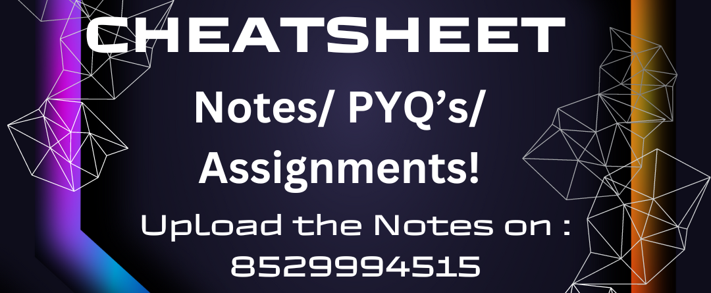

Here’s how you can structure the content for your **CheatSheet** project in the README for GitHub:

---

# CheatSheet: A One-Stop Hub for College Students 📚🎓
<center></center> 
<b>Provides overall content/ Notes/ PYQ's Papers / Assignments / Updates later it will be Updated! --DD Productions.</b>

Welcome to **CheatSheet**, your ultimate academic companion designed specifically for college students who may miss classes, need quick access to important academic resources, or want to stay updated on their college activities. This repository showcases a platform that centralizes everything a student needs – from notes, assignments, to project showcases – making college life more organized and stress-free.

---

## 🚀 **Project Overview**

**CheatSheet** is built with the aim of solving common academic challenges faced by students. Whether it's missing class, tracking assignments, or accessing study materials, **CheatSheet** brings everything into one easy-to-navigate platform. The system is designed to simplify academic management by offering:

- **Centralized Access** to Notes, Assignments, College Updates, and more.
- A **Project Showcase** section where students can share their academic and personal projects.
- A **College Notification Hub** for important announcements, results, and upcoming deadlines.

---

## 📂 **Repository Contents**

Here’s what you will find in this repository:

1. **Notes Repository**:  
   - A collection of **subject-specific notes** contributed by students, ensuring that everyone has access to study materials.
   - Notes can be easily downloaded or viewed online for fast reference.

2. **Assignment Tracker**:  
   - A list of **upcoming assignments** with deadlines, submission statuses, and downloadable files to keep students on track.
   - Automatic **notification system** for assignments and due dates.

3. **College Updates Section**:  
   - Regularly updated with **notifications** about results, events, announcements, and other critical college-related information.
   
4. **Project Showcase**:  
   - A platform for students to showcase their personal or academic projects, providing a link to their GitHub repositories.
   - A clean, simple display for presenting projects, which can help students build portfolios for internships or job applications.

---

## 🔧 **Technologies Used**

Here are the key technologies and platforms that power **CheatSheet**:

- **Frontend**:  
   - HTML5, CSS3, JavaScript, and Bootstrap for responsive design and easy navigation.
   - **jQuery** for interactivity and smooth user experience.
   
- **Backend**:  
   - Basic static platform designed to minimize risk and avoid students uploading unwanted documents.
   
- **GitHub Integration**:  
   - The **Project Showcase** section is designed to link directly with **GitHub repositories**, allowing students to showcase their work without the risk of uploading unnecessary files.

---

## 🌱 **Getting Started**

To get started with **CheatSheet**, follow the instructions below:

1. **Clone the Repository**:
   ```bash
   git clone https://github.com/your-repo/cheatsheet.git
   ```

2. **Open in Browser**:
   - Simply open the `index.html` file in your browser to start using the platform.

3. **Customize for Your College**:
   - You can edit the template and add your college-specific assignments, notes, and updates as needed.
   
---

## 🎯 **Future Roadmap**

We have exciting plans for future versions of **CheatSheet**. Here’s what you can expect:

1. **Dynamic Content**:  
   - Introduce dynamic content management, where students can interact with the platform to upload their own notes or projects (with approval).

2. **Mobile App**:  
   - A companion mobile app for easy access to **CheatSheet** on-the-go.

3. **Advanced Notification System**:  
   - Enhance the notification system to send alerts for upcoming deadlines, class cancellations, or important announcements.

4. **User Profiles**:  
   - Allow students to create and maintain profiles, showcasing their work and academic achievements.

---

## 👥 **Meet the Team**

The **CheatSheet** project was developed by a group of dedicated students who wanted to make college life more organized for everyone:

- **Dhruv Dhayal** – Project Lead and Developer
- **Team Members**:  
   - A group of passionate developers and designers who contributed to building the project.

---

## 🛠 **Contributing to CheatSheet**

We welcome contributions from anyone looking to help improve **CheatSheet**! Here’s how you can get involved:

1. **Fork the Repository**:  
   Create your own fork of the repository to start contributing.

2. **Report Issues**:  
   Found a bug or have a feature request? Open an issue in the repo and let us know.

3. **Submit Pull Requests**:  
   Make improvements, add features, or fix bugs and submit a pull request to get your code reviewed and merged.

---

## 📢 **Feedback & Support**

We value your feedback! If you have suggestions, encounter issues, or would like to discuss potential collaborations, feel free to:

- **Open an Issue** on GitHub.
- Reach out to us via **email** or the contact details provided in the repository documentation.

---

Stay tuned for more updates as we continue to enhance **CheatSheet** and make college life easier! 🎓

---


## 📖 **Content Library:**

- **Comprehensive**: Access a vast collection of college notes, assignments, and past question papers (PYQ) across various subjects and universities.  
- **Organized**: Search and browse easily through categorized content by subject, university, course, and semester.  
- **User-Contributed**: Encourage students to upload their own notes, assignments, and PYQs, building a collaborative knowledge base.  
- **Quality Control**: Implement a moderation system to ensure uploaded content is accurate, relevant, and helpful.  

---

## 🛠 **Learning Tools:**

- **Flashcard Maker**: Create personalized flashcards from key concepts and formulas for efficient revision.  
- **Mind Map Builder**: Visually organize complex topics and study materials for better understanding.  
- **Practice Tests**: Generate custom quizzes based on PYQs and user-uploaded content to test knowledge retention.  
- **Study Planner**: Set goals, track progress, and schedule study sessions to stay organized and motivated.  

---

## 🧑‍🤝‍🧑 **Community Features:**

- **Discussion Forum**: Connect with fellow students, ask questions, share tips, and collaborate on study projects.  
- **Tutor Matching**: Find qualified tutors for specific subjects or topics for personalized academic support.  
- **Study Groups**: Create or join online study groups based on course or topic for interactive learning and peer support.  
- **Rewards and Recognition**: Implement a gamification system to incentivize contributions, participation, and academic achievements.  

---

## ⚡ **Additional Features:**

- **Cloud Storage**: Securely store your notes, flashcards, and study plans in the cloud for access anywhere, anytime.  
- **Offline Access**: Download essential content for offline study sessions without an internet connection.  
- **Mobile App**: Develop a user-friendly mobile app for on-the-go access to all CheatSheet features.  
- **Personalized Recommendations**: Utilize user data and AI to suggest relevant content and learning tools based on individual needs.  

---

## 🌟 **Features**

- **All-in-One Academic Hub**: Students can access important resources such as notes, assignments, and project showcases from one centralized platform.  
- **Assignment List**: A dedicated section where students can view, download, and track upcoming assignments, ensuring they never miss a submission.  
- **Notes Repository**: A comprehensive collection of subject-specific notes contributed by students, providing easy access to study materials.  
- **Project Showcase**: A platform for students to showcase their personal or group projects, linking directly to their GitHub repositories.  
- **College Updates**: Instant access to important announcements, results, and notifications from the college website, keeping students up to date with college events and activities.  
- **User-Friendly Interface**: The interface is simple and intuitive, allowing students to navigate through the platform effortlessly and find what they need quickly.  
- **Responsive Design**: Fully responsive, meaning it works well on all screen sizes, from smartphones to desktops.  

---

## 🧩 **Real Problems Solved**

1. **Problem: Students Missing Classes or Updates**  
   - **Solution**: Provides a centralized platform where all academic resources, updates, and notifications are available in one place, ensuring that students who miss classes never fall behind.  

2. **Problem: Difficulty in Managing Assignments**  
   - **Solution**: The **Assignment List** helps students track their assignments and deadlines, preventing missed submissions and making it easier to stay organized.  

3. **Problem: Lack of Access to Study Materials**  
   - **Solution**: The **Notes Repository** makes it easier for students to access notes for various subjects, whether they missed a class or need to revise for exams.  

4. **Problem: Inability to Showcase Personal Projects**  
   - **Solution**: The **Project Showcase** allows students to display their projects in a professional way, linking to GitHub repositories, helping them build a portfolio for internships or jobs.  

5. **Problem: Missing Important Notifications**  
   - **Solution**: The platform aggregates **College Updates** such as exam results, event announcements, and other important notifications, ensuring that students are always in the loop.  

6. **Problem: Navigating Through Multiple Websites for Resources**  
   - **Solution**: Instead of having to go through multiple different websites or platforms to find assignments, notes, and other resources, **CheatSheet** provides a **one-stop solution**, saving students time and effort.  

7. **Problem: Managing Different Projects and Files**  
   - **Solution**: The **Project Showcase** allows students to keep their projects organized in one place, making it easier to manage multiple projects and keep track of their progress.  

8. **Problem: Ensuring All Resources Are Accessible on All Devices**  
   - **Solution**: The platform is designed with a **responsive layout**, making it easy to use on any device—whether you're on a mobile phone or a laptop.  

---

<hr>
<h1>Gallery Section (Overview Of Project)</h1>
<div style="display: flex; flex-wrap: wrap; gap: 10px;"> 
    <br>
    <br>
    <br>
    <br>
    <br>
    <br>
    <br>
    <br>   
</div>


## 📄 **License**

Distributed under the MIT License. See <a href="https://github.com/BlockNotes-4515/CheatSheet/tree/main?tab=MIT-1-ov-file#">`MIT`</a> for more information.

---

## 📧 **Contact**

- **Creator and Productions By**: Dhruv Dhayal  
- **Email**: dhayaldhruv271@gmail.com  
- **LinkedIn**: [LinkedIn Profile](https://www.linkedin.com/in/dhruv-dhayal-9568b7262/)  
- **Instagram**: [Instagram Profile](https://www.instagram.com/dhayaldhruv271/)  

---

This version separates each section with a line and adds emojis for better visual appeal and engagement!
<hr>
<div align="center">


  


</div>
<br><br>    

<!--- ------------------------------------------------------------------------------------------------------------------------------------------------------ -->
<!--- -- Animated Social Icons ----------------------------------------------------------------------------------------------------------------------------- -->
<!--- ------------------------------------------------------------------------------------------------------------------------------------------------------ -->
